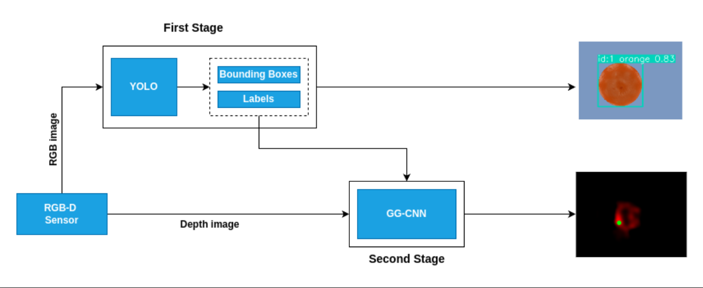

# Selective Grasping Using YOLO-GGCNN

Grasping enables the robots to manipulate obstacles or change its state on the workspace. Grasp detection is a basic skill required for robots to perform grasping and manipulation tasks in the workspace. This project demonstrates a two-staged framework where an object is detected and the grasp prediciton is done within that area. The figure below shows the yolo-ggcnn framework.

## Installation

This code is tested with Python 3.10.12 on Linux Mint 21.3 and CoppeliaSim 4.6. 

## Usage
1. Clone this repository.
2. In CoppeliaSim simulator open the scene file `yolo-ggcnn.ttt`located in assets folder.
3. Run the `run_yolo.py` script.
4. Run the `run_ggcnn.py` script.

## Demo
https://github.com/kalyanksk/yolo-ggcnn/assets/94881228/0fde3233-bef9-4c15-9d92-d53bab0bc1c2

## References
1. [YOLOv8](https://github.com/ultralytics/ultralytics)
2. [GG-CNN](https://github.com/dougsm/ggcnn)

